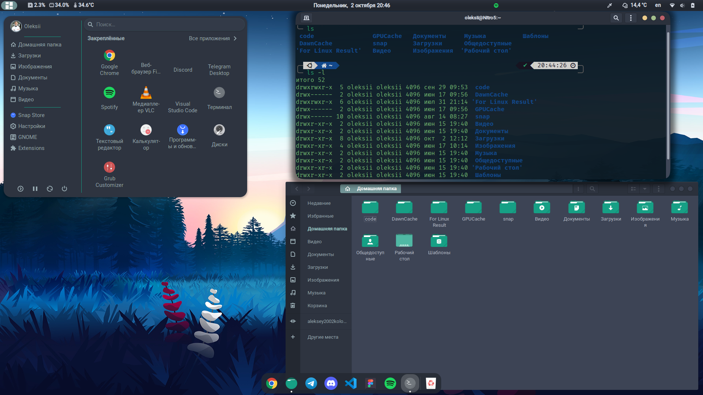
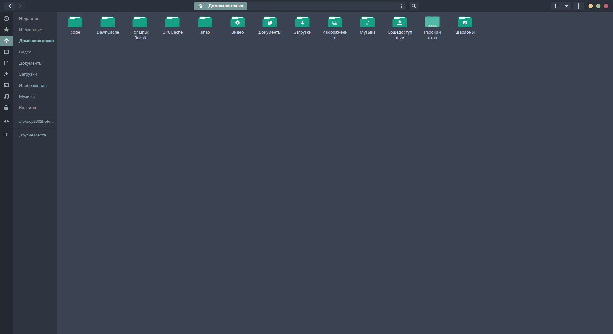

# Кастомізація Linux Ubuntu
___

## Налаштування включають в себе
- Grub (завантажувач операційної системи)
- Gedit (текстовий редактор.)
- Gnome (середовище робочого стола)
- Configs та скріншоти розширень для Gnome 
- Terminal
- Декілька сетів іконок, тем, курсорів, та оболонок
___

## Декілька скріншотів результату

